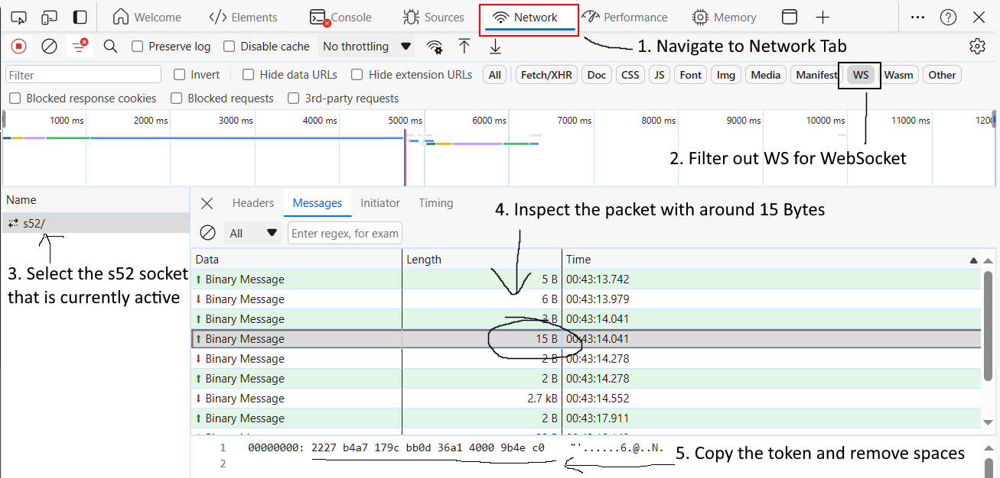

# Gold Digger
Python script to automate gold farming in Territorial.io.

This code is only for educational purposes and should not be misused in any way or form.


## How to use

1. Extract the login token from the Network tab in the browser's developer tools (F12)


*Update: You don't have to remove spaces from the Token for it to work*

2. Install required Python dependencies
- asyncio (Should be included in Python 3.4+)
- websockets

```bash
$ pip install -r requirements.txt
```

3. Build native security module using a compiler

*Note: You can use any compiler you want, but the following instructions are for GCC*
*Update: Security module now has an spedup version with the same name. The old source is renamed to `old_security.c`*

```bash
$ cd security
$ mkdir bin
$ gcc -o ./bin/security security.c
```

4. Run script with the extracted token

*Note: Make sure that you are currently in the same directory as the `main.py` script.*

Example:
```bash
$ python main.py 69a45135d14c125b1248235c25bca0
```
OR
```bash
$ python main.py
Enter account token: 69a45135d14c125b1248235c25bca0
```

5. Enjoy your gold!

6. To stop the script, press `Ctrl+C` to interrupt the process.


## Testimonials
We are accepting more testimonials! Please DM **@teinc3** on Discord.

- Testimonial from DanTheMan<br>


- Testimonial from Luxus<br>
